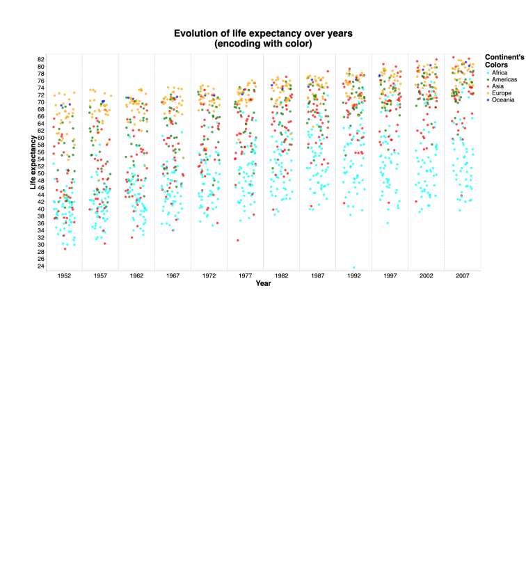
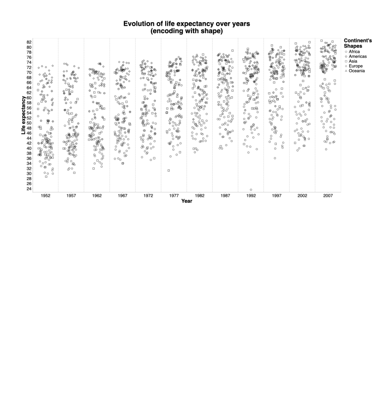
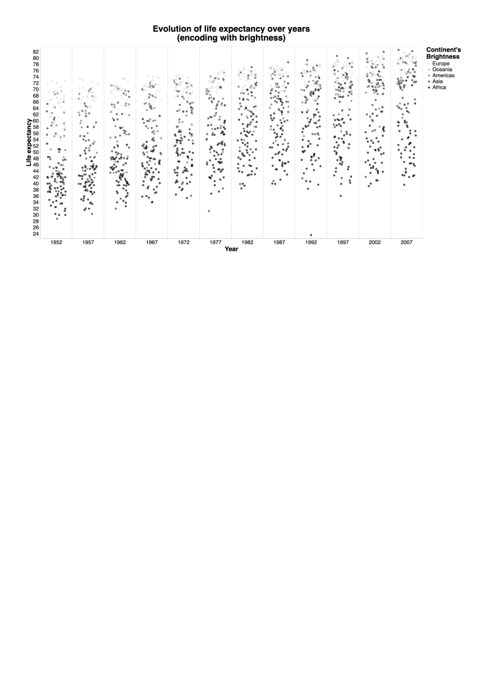
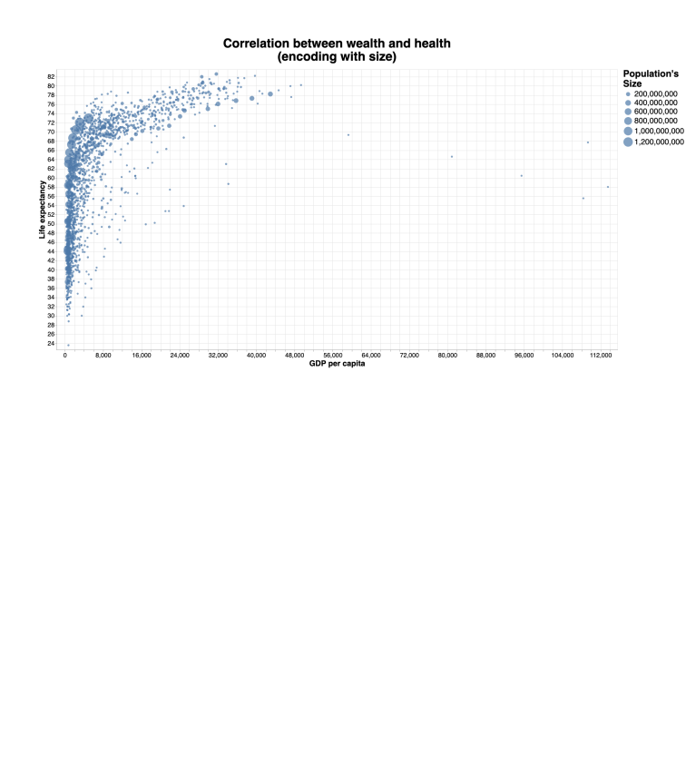
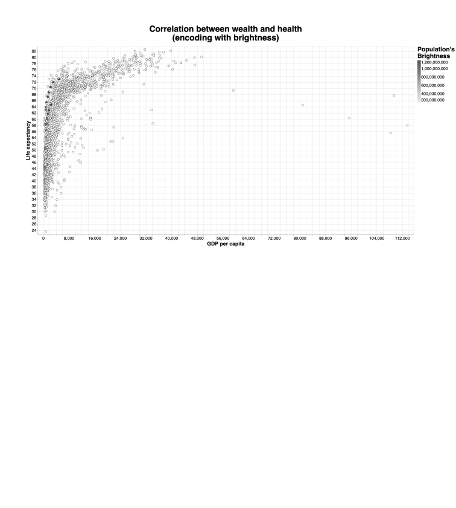
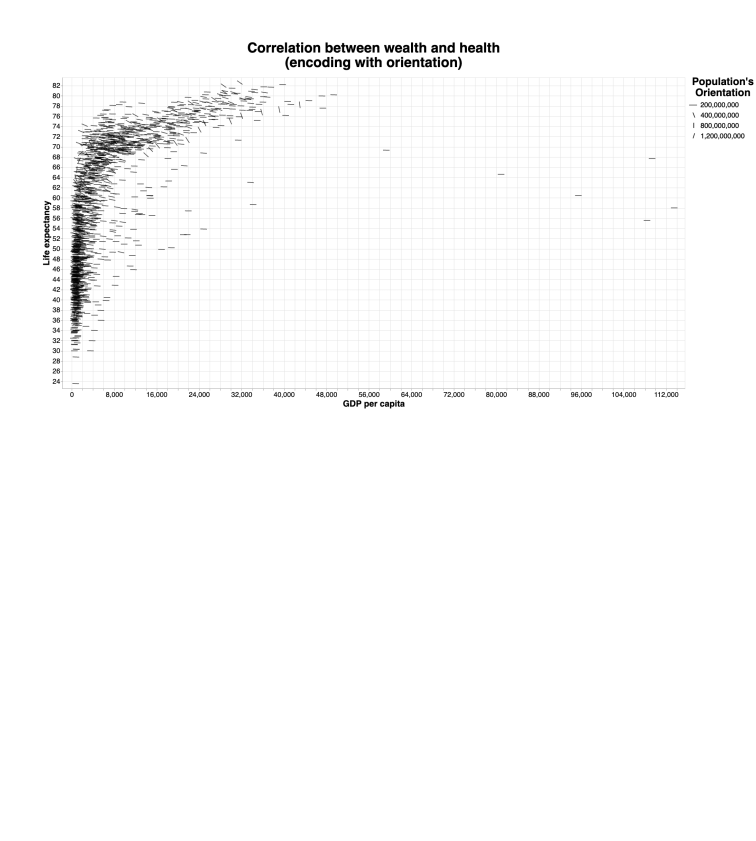
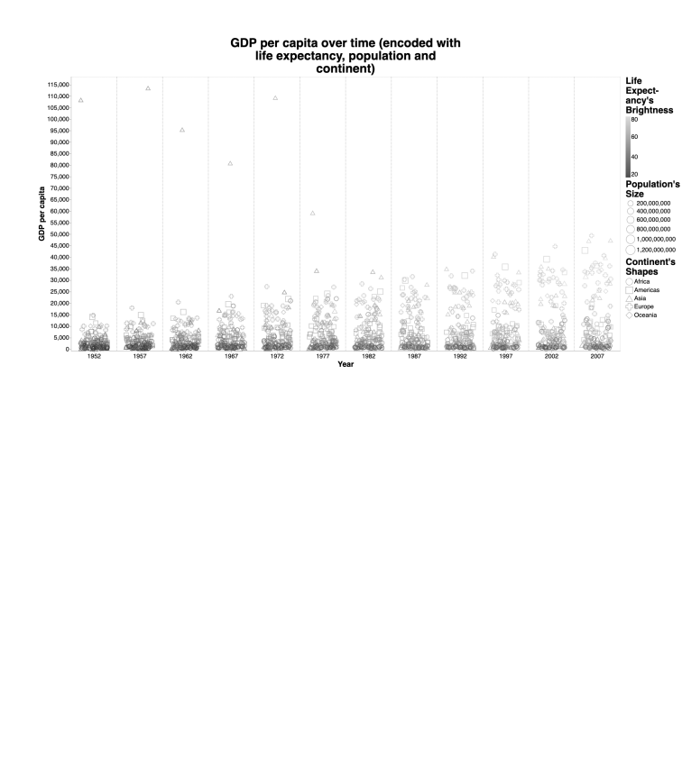

# Visualizing data from gapminder.org
This repository contains visualizations from gapminder.org, non-profit fighting global misconceptions. The data used can be found [here](https://cran.r-project.org/web/packages/gapminder/index.html). Details about my implementation are noted in my [report](report/report.pdf).

# Requirements
I used Python 3.9 for this visualization. The packages used for this project can be found in the virtual environment. You can activate it by following the commands below for Linux/MacOS:

```
source venv/bin/activate
```


# How to run
```
python3 main.py
```

# Final visualizations







